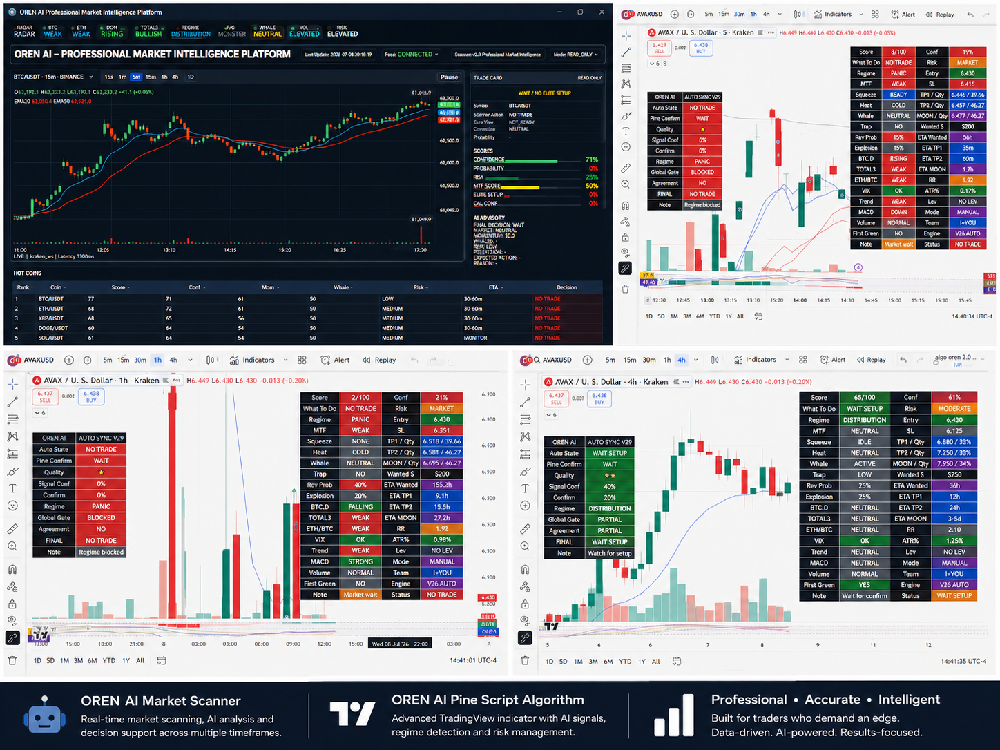
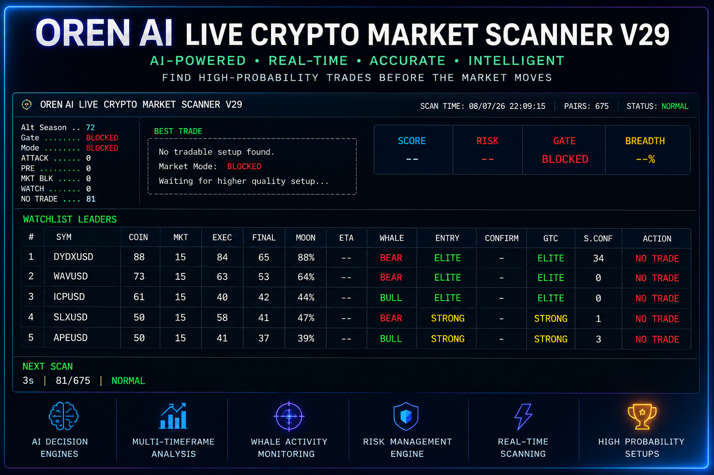
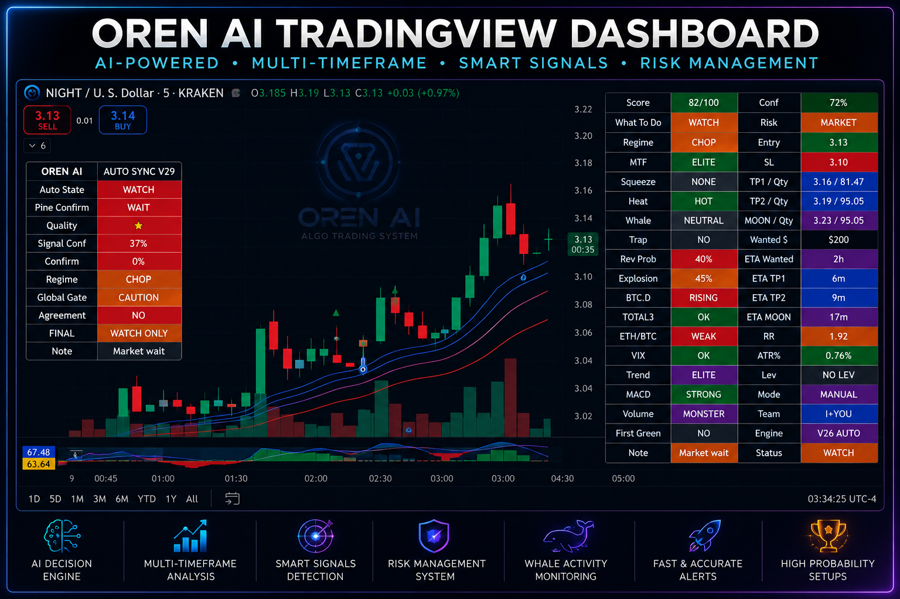
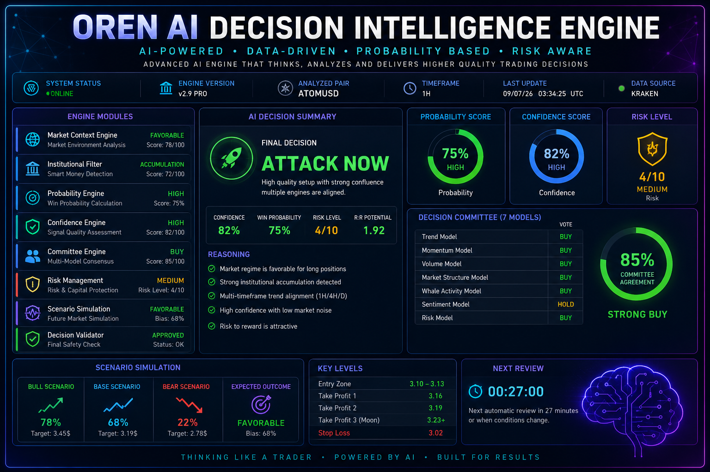

# 🚀 OREN AI Trading Platform
## Platform Preview

Professional AI-powered cryptocurrency trading platform built from scratch using Python and TradingView Pine Script.

## Overview

OREN AI is an intelligent decision-support platform designed to help traders identify high-probability trading opportunities using multiple AI engines working together.

## Main Features

- 🧠 AI Decision Intelligence Engine
- 📊 Real-Time Python Market Scanner
- 📈 TradingView Pine Script Dashboard
- ⚡ Multi-Timeframe Analysis
- 🐋 Whale Activity Detection
- 📉 Risk Management Engine
- 🎯 Probability Scoring
- 🤖 Automated Trading Recommendations
- 📡 Kraken API Integration
- 🔥 Professional Trading Dashboard

## Technologies

- Python
- TradingView Pine Script
- REST API
- JSON
- Artificial Intelligence
- Machine Learning Concepts
- Market Analysis
- Cryptocurrency

## Project Status

Active Development

New AI modules and trading intelligence components are continuously being added.

---

Designed and developed by **Oren Barak**
